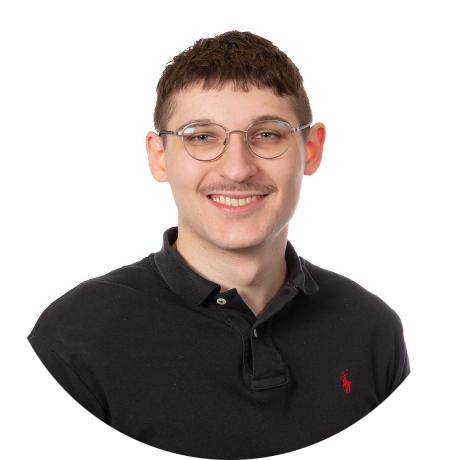

<h2>Hey, I'm Cordell Michaud! (he/him)</h2>

<!--

-->

<h3>Work</h3>

<ul>
    <li>
        <em>Software Application Associate</em> at <a href="https://www.lroc.asu.edu/">Lunar Reconnaissance Orbiter Camera Science Operations Center (LROC)</a> 
        School of Earth and Space Exploration 
        Arizona State University
    </li>
</ul>

<h3>Education</h3>
<ul>
    <li>
        <em>Bachelor of Science in Computer Science</em> 
        Arizona State University, Spring 2021
    </li>
    <li>
        <em>Master of Computer Science</em> 
        Arizona State University, degree anticipated Fall 2024
    </li>
</ul>

<h3>Main Skills</h3>

<ul>
    <li>Python</li>
    <li>C++</li></li>
    <li>Data Analysis</li>
    <li>Geographic Information Systems (GIS)</li>
</ul>

<h3>Currently Learning</h3>

<ul>
    <li>Machine Learning</li>
    <li>Go</li>
    <li>Javascript</li>
    <li>Rust</li>
</ul>

<h3>About Me</h3>

    I am an experienced software developer with a particular interest in the intersection of geographic information systems (GIS) and data science.

    I am skilled in a variety of programming languages and technologies, primarily Python and C++. I also have substantial domain knowledge in GIS and image processing for remote sensing applications in space missions, as well as experience working in multidisciplinary teams composed of analysts, researchers, and other developers on long-term, open-ended projects.

    I am adaptable and continuously expanding my knowledge of the state of the art when it comes to scientific and numerical computing, and I am eager to apply this knowledge to challenging research software engineering roles.

